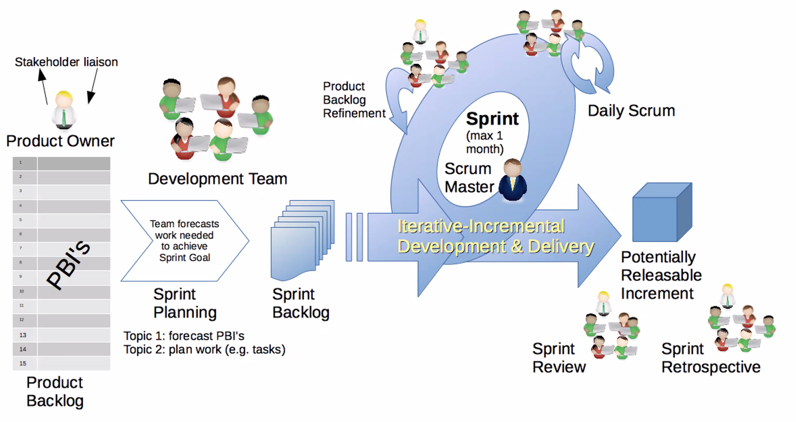
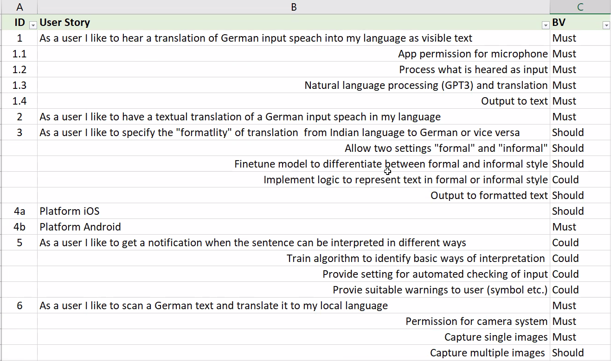

# International project management

- 8 subprojects (5 people max. per group)
- Prioritize the choices

## Main (IPM) project

Org: Digital Hearing Platform "Luise lauscht"

### Constraints

- GDPR
- Development time is 6 months
- Target group: Children (4-6 Yrs. old), parents and teachers
- The children cannot read! (Graphical, Audio, [Video])
- The digital hearing platform will be developed as a plugin for Moodle (LearnSax).
- Learning games (Single and multiplayer [On- and offline]). For example "Guess the sound" or "Sound-Memory"
- Progression (Has to have learning curve). Therefor admins and families and teachers (roles) have to be able to provice learning-content (CMS)
- Detailed literature analysis, technical concept, user interface up to the final time and budged planning

URL: <https://sbbz-luise.de>

Audio learning platform for the school SBBZ Luise von Baden for bad hearing children.

You are a member of a highly innovative IT-consulting company. You and your team must develop a concept or feasibility study for one of the following customer project.

### Ideas

- Chat (With Symbols)
- Voice Chat

#### Concept

- Replicate the sound

#### Games

- Reward system...movies.
- Mockups

## Subprojects

1. Frontend: Moodle Plugin Team
2. Backend: Moodle Plugin Team
3. Moodle Technology Team
4. UI/UX Team
5. Game Scenarios **Quiz** Team
6. Game Scenarios **Memory** Team
7. Free Game Scenarios Team
8. Free Game Scenarios Team

## Module components

1.

## Exams

1. Report (In moodle)
2. Oral-exam (15min)

## Methods

### Project Organisation

### Influence Organisation

One Project Manager

Not your own authority -> it comes from your boss

Sometimes the only thing you can do as a PMgr. is escalate

### Pure PO (Project Organisation)

PMgr. (Project manager) has the complete disciplinary responsibility for all resources.

### Matrix Organisation

2 Organisation

Linear Organisation (Vertical)

Project Organisation (Horizontal)

Typically manufacturing businesses

## Agile

- ~2 weeks iterations
- Individuals and interactions over processes and tools (Communication between for example front- and backend. Processes have to be flexible)
- Working software over comprehensive documentation (Code review and documentation)

### User story

Describe the user

### Epic

Super user story

### User journey

general für all agile methods

can have several Epics in between

### Teams in agile

1. Translator
2. SCRUM-Master
3. Developers
4. Testers

### Kanban

- Only focus on one item at a time otherwise bad reaction to change

User Story

1. Refined
2. Estimated
3. Planned
4. Development
5. Testing
6. Done

Define what done means (DoD [Definition of Done])

| Developer | Refinement | Estimation | Planned | Development | Testing | Done |
|:----------|:-----------|:-----------|:--------|:------------|:--------|:-----|
| Hans      |            | Item       |         |             | Item    |      |
| Eva       | Item       |            | Item    |             |         |      |
| Martin    | Item       | Item       | Item    |             |         | Item |
| Udo       | Item       |            | Item    |             |         | Item |
| Katrin    |            | Item       |         | Item        |         | Item |

A backlog is a Bucket of User stories not yet addressed.

| Release Backlog                                                                      | Sprint Backlog                                          |
|:-------------------------------------------------------------------------------------|:--------------------------------------------------------|
| Sum of all US (UserStories)   not yet addressed and not yet planned for an iteration | Assigned US to iterations but not yet in implementation |

### Scrum

- Sprint retrospective: Opportunity to look back on the sprint and optimise.

### Example user story

### Estimation is important in agile projects

### Ordering methods

1. Planning poker with fibbonacci rang
2. Order by fibbonacci range people complain until everybody is happy
3. Ordering method (compare ech to each)

## Report

1. Short project description
2. Detailed project concept
    2.1. Project management process model
    2.2. Technological specifications
