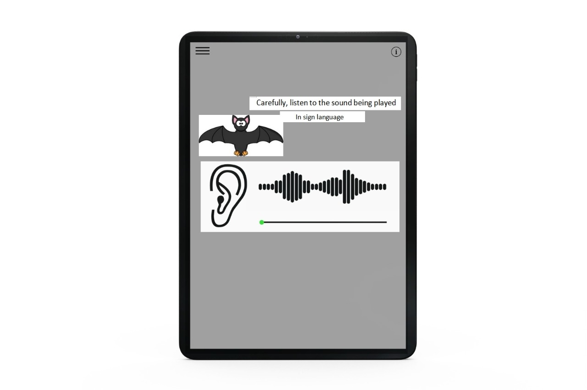

# Mockups

## 1. Kid signs in or is already signed in (Use moodle as auth-service)

## 2. Character creation screen for the avatar (They can attach a sound to their created character) [Scrapped]

## 3. Tutorial

## 4. The kid sees a WAVE-display of a sound with a name in sign-language

## 5. Instructions on finding the SOS is given by the mascot via sign-language

## 6. Then the kid has to "follow" the sound to reach its source

### 6.1. If distance decreases volume increases

### 6.2. If distance increases volume decreases

## 7. The kid sees a 2D/3D-representation of the SOS in AR-space

### 7.1. The kid has to tap it to collect it

## 8. A mini-games opens-up

## 9. The mascot celebrates the kid

