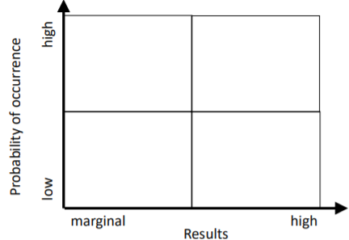
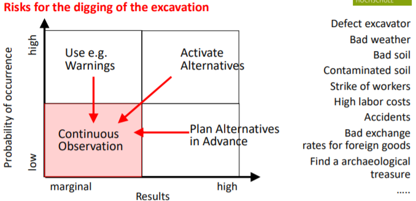

# Project report

## Project Description

## Target State

- Higher Level Objectives
  - Cost calc (we don't have that yet)
  - Scope
  - Time calc (we don't have that yet)
- Result Objectives
  - Are our features
- Process Objectives
  - We're using an agile approach
  - Hybrid between Design Thinking and Kanban/Scrum
- Personal Objectives
  - Our POV

## Project Structure Plan

1. Product structure plan
   1. What will be delivered? Product and components?
2. Utilities structure plan
   1. Plans, provisory results, tools, reports, analyses, documentations

## Network Plan

Activities and work packages, time and resource planning

- Gantt-Chart
- Arrow Diagramming Method (ADM)
- Precedence DiagrammingMethod (PDM) als called activity-on-node (AON)
  - Used by most project management methods

## Project status report

- Milestone trend analysis
  - Looking into the future
  - Act fast!
  - Could have dependencies or not
  - Shows quality of project-plan
  - Elements
    - Square (Going as planned)
    - Triangle (Is going faster)
    - Circle (Is going slower)

## Chance and Risk Management

### Portfolio Method

### Risk Balance Chart
