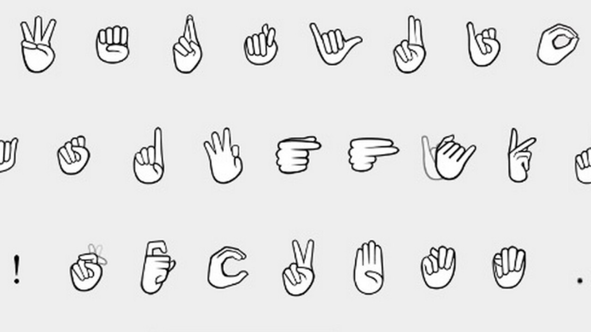

# Tasks (Kanban)

| To do      | In progress | Review | Done |
| :--------- | :---------- | :----- | :--- |
| -          | 1 (Mahima)  | -      | -    |
| 2 (Mahima) | -           | -      | -    |
| 3 (Mahima) | -           | -      | -    |
| -          | 4 (Nik)     | -      | -    |
| 5 (Nik)    | -           | -      | -    |
| 6 (Nik)    | -           | -      | -    |
| -          | 7 (Vipul)   | -      | -    |
| 8 (Vipul)  | -           | -      | -    |
| 9 (Vipul)  | -           | -      | -    |

## Tasks

### Mockups (Must include tablet-frame)

1. Kid signs in or is already signed in (Use moodle as auth-service)
2. Character creation screen for the avatar (They can attach a sound to their created character)
3. Tutorial
4. The kid sees a WAVE-display of a sound with a name in sign-language
5. Instructions on finding the SOS is given by the mascot via sign-language
6. Then the kid has to "follow" the sound to reach its source
   1. If distance increases volume decreases
   2. If distance decreases volume increases
7. The kid sees a 3D-representation of the SOS in AR-space
   1. The kid has to tap it to collect it
8. A mini-games opens-up
9. The mascot celebrates the kid

#### Common ground

- Colors
  - Primary: #fff
  - Secondary: #2adb2a
- Icon-pack used must be Material Design Icons
- Use signily-hand pictures for sign-language-mocking

