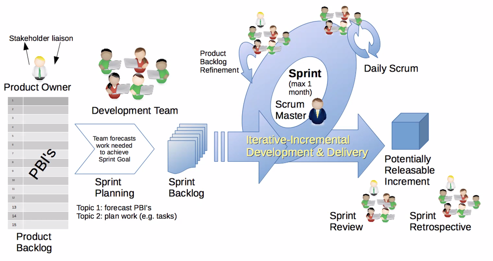
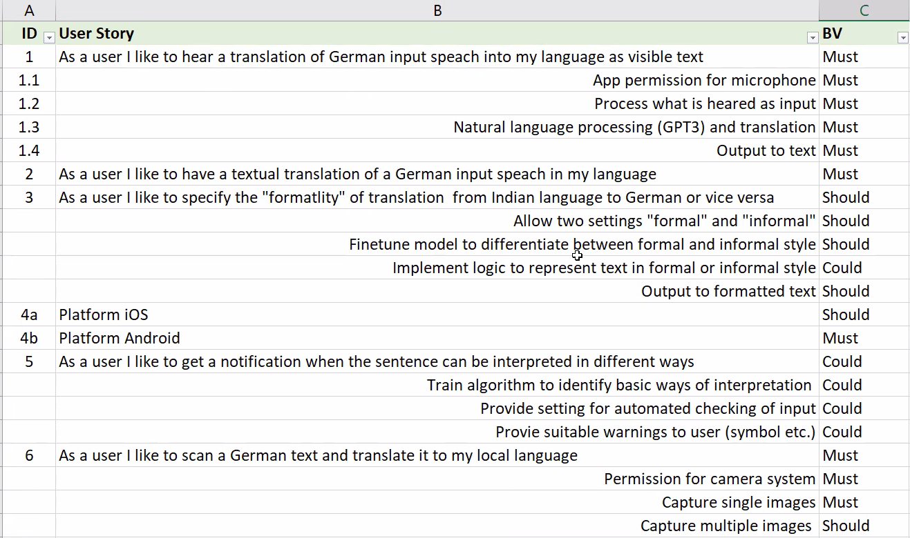
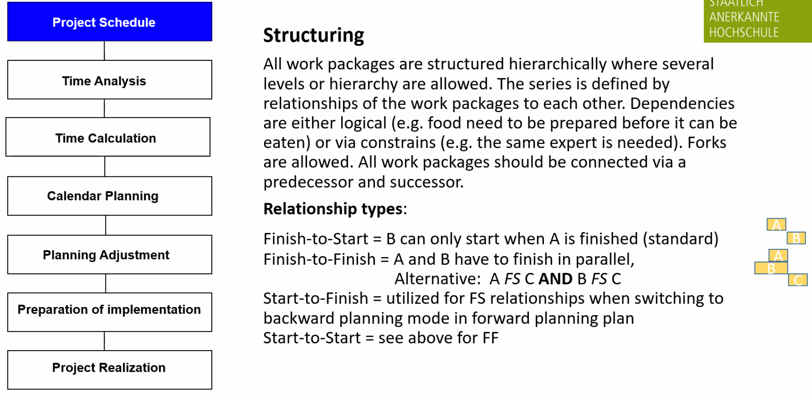
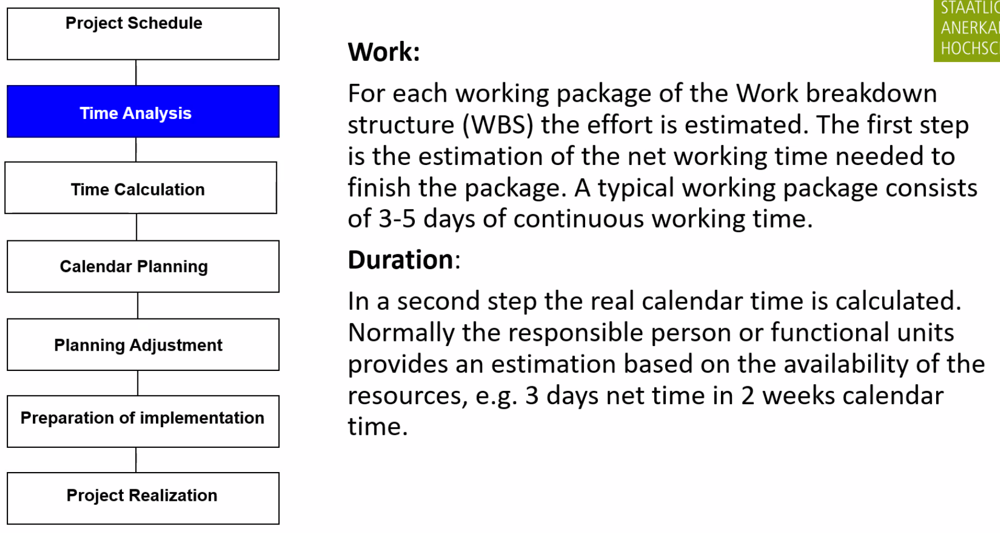
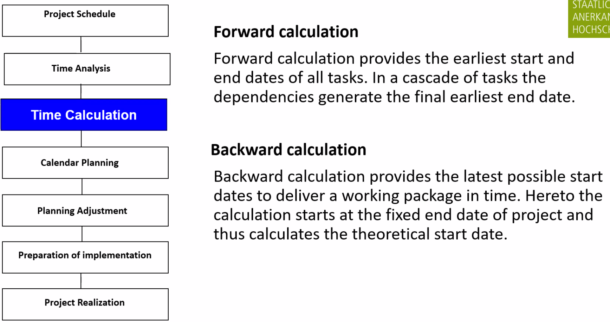
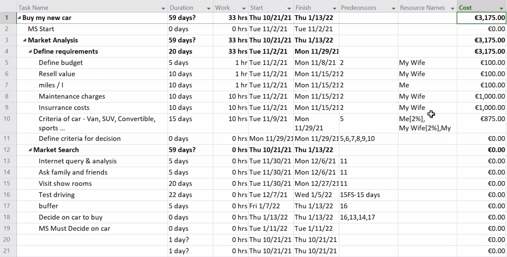
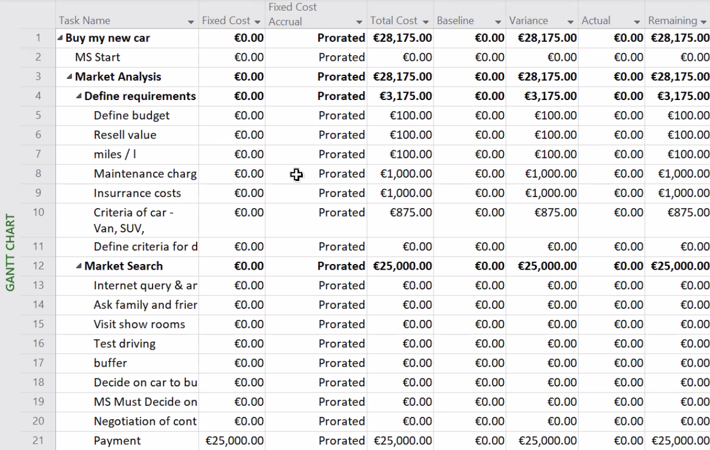
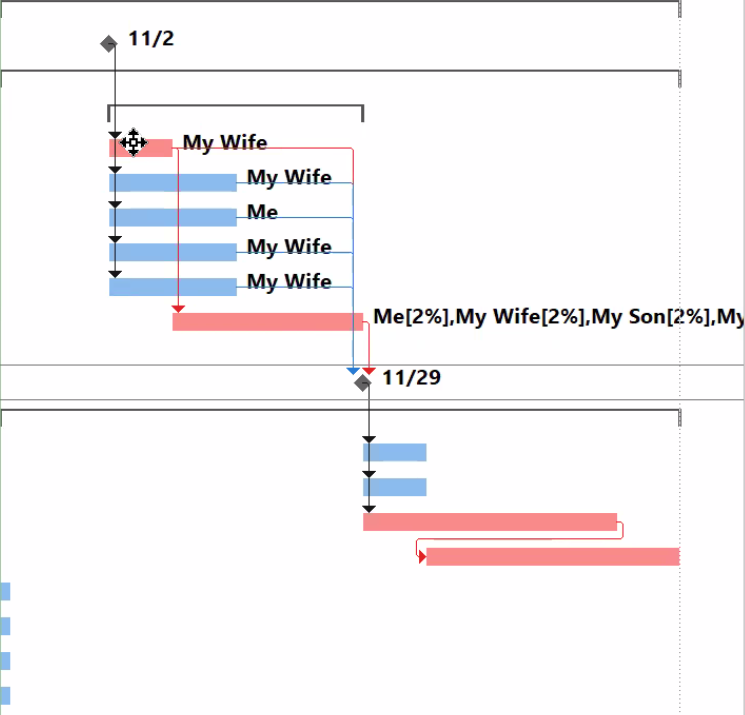

# Theory-script

## Methods

### Project Organisation

### Influence Organisation

One Project Manager

Not your own authority -> it comes from your boss

Sometimes the only thing you can do as a PMgr. is escalate

### Pure PO (Project Organisation)

PMgr. (Project manager) has the complete disciplinary responsibility for all resources.

### Matrix Organisation

2 Organisation

Linear Organisation (Vertical)

Project Organisation (Horizontal)

Typically manufacturing businesses

## Agile

- ~2 weeks iterations
- Individuals and interactions over processes and tools (Communication between for example front- and backend. Processes have to be flexible)
- Working software over comprehensive documentation (Code review and documentation)

### User story

Describe the user

### Epic

Super user story

### User journey

general für all agile methods

can have several Epics in between

### Teams in agile

1. Translator
2. SCRUM-Master
3. Developers
4. Testers

### Kanban

- Only focus on one item at a time otherwise bad reaction to change

User Story

1. Refined
2. Estimated
3. Planned
4. Development
5. Testing
6. Done

Define what done means (DoD [Definition of Done])

| Developer | Refinement | Estimation | Planned | Development | Testing | Done |
| :-------- | :--------- | :--------- | :------ | :---------- | :------ | :--- |
| Hans      |            | Item       |         |             | Item    |      |
| Eva       | Item       |            | Item    |             |         |      |
| Martin    | Item       | Item       | Item    |             |         | Item |
| Udo       | Item       |            | Item    |             |         | Item |
| Katrin    |            | Item       |         | Item        |         | Item |

A backlog is a Bucket of User stories not yet addressed.

| Release Backlog                                                                      | Sprint Backlog                                          |
| :----------------------------------------------------------------------------------- | :------------------------------------------------------ |
| Sum of all US (UserStories)   not yet addressed and not yet planned for an iteration | Assigned US to iterations but not yet in implementation |

### Scrum

- Sprint retrospective: Opportunity to look back on the sprint and optimise.

### Example user story

### Estimation is important in agile projects

#### Top-Down

As indicated by the name the framework of a project is defined by management, that means time lines and budget are normally fixed. Further detailed planning has to acknowledge the framework and thus sets itself limits.

#### Bottom-Up

Project planning is based on a detailed evaluation that in the end is reflected in a final plan proposal. Pure bottom-up approaches tend to run into conflicts with management, therefore both methods are normally combined.

### Ordering methods

1. Planning poker with fibonacci rang
2. Order by fibonacci range people complain until everybody is happy
3. Ordering method (compare ech to each)

## Planning

### Classical planning vs agile planning

- Classical approach is not managing time buckets. Its is approaching dependencies
- In agile the dependencies do not have to be ordered...they are all the same
- You can assign a team to a sprint and the team will pick the user stories (self organised)

#### Classical planning

##### Example (duration calculation)

| Overhead        | Week | Year |      |       |
| :-------------- | :--- | :--- | :--- | :---- |
| Public holidays | 12   | 238  | 1904 |       |
| Holidays        | 30   | 238  | 1664 |       |
| Sickness        | 5    | 208  | 1624 |       |
| Training        | 5    | 203  | 1584 | 0.904 |

| Overhead          | Week | Year  |        |        |
| :---------------- | :--- | :---- | :----- | :----- |
| Meetings          | 4    | 166.4 | 1417.6 | 0.7088 |
| Personal training | 2    | 81.2  | 1336.4 | 0.6682 |

##### Example (time calculation (usually done in MS-project))

###### Remember

1. **Be sure to focus on the tasks on the critical-path!**
2. **Avoid tasks without further connections!**
